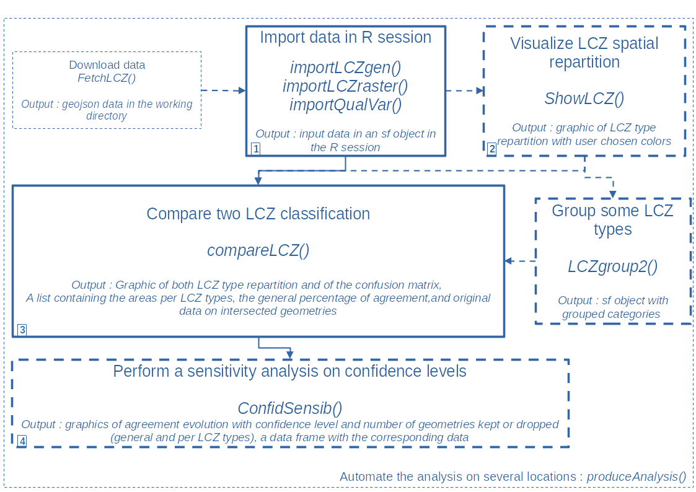
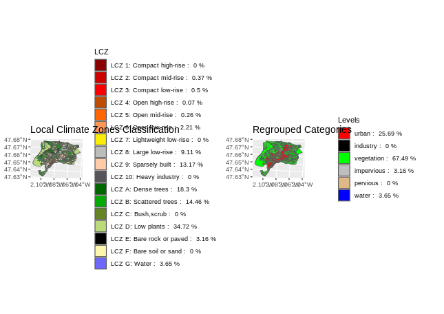
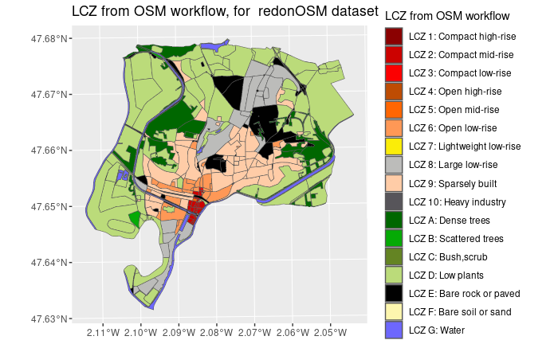
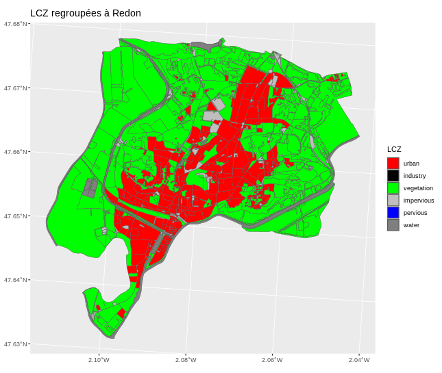

# Summary

Climate change is a growing concern for city planners as Urban
Heat Islands has an impact on mortality [@clarke1972some], health in general [@lowe2016energy] and consumption of energy for building cooling [@malys2012microclimate] among other effects. A first step towards large scale study of urban climate is to define classes based on logical division of the landscape, such as Local Climate Zones (LCZ) defined by [@stewart2012local].

The lczexplore package aims at comparing different LCZ classifications, but could be used to compare any type of classifications on geographical units.

A spatial comparison is performed by producing agreement maps between classifications. A confusion matrix also helps to better qualify and quantify the misclassifications.

This software is available as a free and opensource R package.

# Statement of need

Climate change is a growing concern for city planners with a special focus on Urban Heat Island phenomenons. The terms rural and urban lack of a clear definition and several classification of urban and rural landscapes were proposed. 
Stewart and Oke  [@stewart2012local] proposed an approach that complies with [@grigg1965logic] criteria of geographical classification. 
Their Local Climate Zones are based on a logical segmentation of land-use and urban canopy parameters and define 10 urban types and 7 land cover types. 
It has gained popularity in the past decade as it sums up relevant information and can help, for instance, apprehend the intensity of the Urban Heat Island ([@kotharkar2018evaluating]).

Several papers describe methods to produce LCZ classifications, but there are fewer workflows that automatically produce them from available data.
[@quan2021systematic] distinguishes two main streams of production of these LCZ:  
- the raster stream processes remotely sensed information, and applies machine learning algorithms trained using local experts' knowledge. 
For instance, the WUDAPT platform produced LCZ maps of Europe and North-America this way.  
-  the vector stream uses Geographic Information System (GIS) layers that represent the main topographic features, defines spatial units, 
computes urban canopy parameters and uses them to classify spatial units into LCZ. 
For instance, the GeoClimate geospatial toolbox produces LCZ classifications from OpenStreetMap or french BDTopo data [@bocher2021geoclimate].  

The existence of several methods to produce LCZ classifications, or the use of a method with different input data raise the need to quickly get :

1. A statistic measuring the general agreement between two classifications
2. A  spatial representation of this agreement, to allow a fast visual assessment of the zones where the classifications differ.
3. A confusion matrix, to explore how the levels of one classification break up in levels of the other classification, 
shown in a graphical way to help visualize the main differences between the classifications.

# State of the field and feature comparison

## State on the field on spatial classification comparison

To the best of our knowledge, there is no tool specifically dedicated to comparing classifications on spatial units. 
This package is intended to compare the results of Local Climate Zones produced by different algorithms or with the same algorithm and different input data, 
but it should stay relevant to compare any pair of spatial classifications.

A comparison of a raster stream result and a GIS vector stream approach was proposed by [@muhammad2022inference]. 
This comparison relies on raster data, and it seems that the two classification must be produced on the same grid. 
It uses several tools: QGIS, python scripts and SAGA GIS. As far as we know, the scripts and the automation of the method are not publicly available.

## Features

### General workflow and processing steps

The lczexplore package allows to load, show and compare LCZ classifications, even when they don't use the same spatial units to classify the area.


{ width=100% }

This figure describes the general workflow of the package. Main functions are presented in plain lines, the dashed box represent optionnal steps.

1. First, the LCZ classifications are imported, from a geojson file or shapefiles.
2. Each LCZ classification can then be plotted
3. The two LCZ classifications are then compared :
    1. A map of the agreement/disagreement is produced
    2. The general agreement is computed
    3. The summed surface of each LCZ type is computed for each classification
    4. A confusion matrix shows how the levels of one LCZ classification break up into the levels of the other classification.
    5. Influence of the level of confidence on the agreement between classifications is performed (sensitivity analysis)


All the steps of the analysis (except the production of the LCZ classification themselves) are done in the same R environment and can be easily automated.


### Description of the main functions

#### From import to comparison

The `importLCZgen` function allows to import any classification from a geojson or a shape file. 
Geometries and LCZ types are needed, but one can also optionally load identifiers for the geometries and a confidence level for the LCZ type of each geometry.  
The `importLCZraster` allows the import from a raster function.  

The package doesn't rely on regular tile grids (no rasterization). The `compareLCZ` function creates intersected geometries 
on which classifications either totally agree either totally disagree, and this prevents artificial rounding effects.

{ width=100% }
This figure shows how the resulting intersected geometries either totally agree or totally disagree.

Next, the function computes:  

- the area of each LCZ type for each classification,  
- the percentage of area on which the two classifications agree, and a map of this agreement,  
- a confusion matrix of how the types of one LCZ classification break up in the types of the other, and a graphic of this, with an indicator of the general area of the LCZ type (useful if the two classification disagree on a type almost absent of the area).  


The output of these functions are shown in the minimal example section.

The import and comparison steps can be automated on several locations using the `produceAnalysis` function.


#### Class grouping and comparison of other variables
It is sometimes useful to group some LCZ types, for instance to regroup the urban LCZ types together and the rural LCZ types under another category, 
or group the levels one consider as sensitive on an urban heat island point of view. The package allows the user to specify the LCZ types to group together, their names 
and the corresponding colors.
The `compareLCZ` function can compare datasets with these new grouped categories in the same way it does with original types.



As you can specify, in the main functions of lczexplore, the expected levels of the grouped categories, 
you can use them to compare any pair of qualitative variables available on the same area. 
For readability reason, we limited the number of possible levels of these variables to thirty-six.


#### Sensitivity analysis
Some of the algorithms which produce the classifications may add a confidence value to the LCZ type. 
The lczexplore package allows a sensitivity analysis according to this level of confidence, 
in order to answer the question : **does keeping only geometries with a higher confidence value makes the degree of agreement between two classifications higher ?**
This sensitivity analysis is performed considering all LCZ types or within each individual LCZ type.


The agreement between classifications for the geometries with a confidence level higher than the threshold, and their numbers, are plotted in blue.
The agreement and the numbers of geometries under the threshold are plotted in magenta.


# Coding implementation
`lczexplore` is an R package, all its specific functions are coded in R language. It relies on state-of-the art packages :  
- geographical computation requires the `sf` package for vector data and the `terra` package for raster data,  
- data management mainly requires the following packages : `dplyr, tidyr forcats, rlang` and `methods` packages,  
- graphical production uses `ggplot2, grDevices, cowplot` and `RColorBrewer` packages,  
- tests need the `tinytest` package.  


Every step corresponds to an R function (see the workflow figure for the name of the main functions). Every function has an associated file for the unit tests.


# A minimal example
## Install and load
The lczrexplore package can be downloaded from `https://github.com/orbisgis/lczexplore`

You can install it in R with the command `install_github`:

```r
library(devtools)
devtools::install_github("orbisgis/lczexplore")
library(lczexplore)
```

## Import the data
In this example we will use two LCZ classifications of Redon city, produced using a single LCZ classification method (the GeoClimate workflow), 
but taking two different input data: OpenStreetMap (OSM) and the french BDTopo.

```r

# Set the path to the example data folder created once you install the package

dirPath<-paste0(system.file("extdata",package="lczexplore"),"/")
dirPathOSM<-paste0(dirPath,"osm/2022/Redon")
dirPathBDT<-paste0(dirPath,"bdtopo_2_2/Redon")

# Import into an sf object the data produced with GeoClimate and
# the Open Street Map data (city of Redon)
redonOSM<-importLCZgen(dirPath=dirPathOSM, file="rsu_lcz.geojson", column = "LCZ_PRIMARY")

# Import into an sf object the data produced with GeoClimate and 
# the french BD TOPO data (city of Redon) 
redonBDT<-importLCZgen(dirPath=dirPathBDT, file="rsu_lcz.geojson", column = "LCZ_PRIMARY")

```

## Visualize the data

To visualize an LCZ classification, use the `showLCZ` function :

```r
# Plot the LCZ levels on the Redon Area using the default color set
# from the sf object produced by importLCZgen function

showLCZ(sf=redonOSM, wf="OSM", column="LCZ_PRIMARY", repr="standard", LCZlevels="", cols="")

```

The result is a map of the Local Climate Zones on the area :
{ width=100% }

## Compare the two LCZ classifications

To compare the two loaded LCZ classifications, use the compareLCZ function:

```r
# Compare how the BDTopo and the OpenStreetMap Data produce different classifications. 
# The output are stored in a list. 
# It is also output to a csv file if exWrite=TRUE, in the working directory. The name of this csv file 
# is built from the wf1 and wf2 arguments, which are the names the user gives to the workflows used to produce the data. 
# If you run compareLCZ for the same workflows on different locations with the same workflos, 
# compareLCZ will append new lines to the existing csv file. 


comparison<-compareLCZ(sf1=redonBDT,column1="LCZ_PRIMARY", wf1="BD TOPO v2.2", 
           sf2=redonOSM,column2="LCZ_PRIMARY",wf2="Open Street Map", ref=1,
           repr="standard",exwrite=F,location="Redon",saveG="")

```

The graphical results concatenate all the graphics for a quick glance:

{ width=100% }

The first and second maps show the spatial repartition of the first and second LCZ types, respectively.  
The third map shows where the two classifications agree or disagree.  
The last graphic is a confusion matrix: how do the LCZ types of the first classification break-up in those of the second, in percentage of the surface. 
As it is expressed in percentage, the outer margin color indicates if these LCZ types represent a bigger or smaller surface 
(numeric value available in numeric output stored in the comparison object of this example).

## Study the impact of confidence on agreement

The following code produces an example of confidence sensitivity analysis:

```r
 # Set the path to the folder where compareLCZ stored output data file
 mainPath<-system.file("extdata", package = "lczexplore")
 # Read the csv file where compareLCZ stored the output data. (One could use data from the R object too).
 testSourceFact<-read.csv(paste0(mainPath,"/bdtopo_2_2_osm.csv"),
 sep=";",header=TRUE,stringsAsFactors = TRUE)
# perform the sensibility analysis on this file
# One can also directly read the sfFile without importing it. 
# To do so leave inputDf argument empty but set the filePath argument.
 sensitAnalysis<-confidSensib(inputDf=testSourceFact, filePath="",
 nPoints=5, wf1="bdtopo_2_2", wf2="osm",
 geomID1="ID_RSU", column1="LCZ_PRIMARY", confid1="LCZ_UNIQUENESS_VALUE",
 geomID2="ID_RSU.1",column2="LCZ_PRIMARY.1", confid2="LCZ_UNIQUENESS_VALUE.1",
 sep=";", repr="standard", plot=TRUE, saveG=mainPath)
```

It results in the following graphic, for the agreement per LCZ type (types not present in the dataset are excluded).


For each LCZ type, the x-axis shows the minimum confidence threshold. The y-axis shows the agreement levels. Each blue cyan shows the average agreement between classifications
for spatial units where the minimum confidence value is greater than the x-axis value. 
As one wants to be sure the dropped units didn't have a greater agreement : they are showed as magenta triangles. 
For this particular example, it seems that for the "Open Low" LCZ type, the greater the confidence, the lesser the agreement!
This paradoxical result shows the limits of the algorithm used to predict heights in OSM, and illustrates the interest of these types of sensitivity analysis.

## Group some levels and perform the same analysis
Use the `LCZgroup2` function to regroup some levels into a category. Specify the name of the column of the new regrouped categories with the argument `outCol` (the default is "grouped").

```r
redonOSMgrouped<-LCZgroup2(redonOSM,column="LCZ_PRIMARY", 
                           urban=c("1","2","3","4","5","6","7","8","9"),
                           industry="10", 
                           vegetation=c("101","102","103","104"),
                           impervious="105",
                           pervious="106", 
                           water="107",
                           cols=c("red","black","green","grey","burlywood","blue"))
```


You can then perform the same analysis, but you have to specify that the representation is now grouped (`repr="grouped"`).

```r
showLCZ(redonOSMgrouped, column="grouped",repr="grouped",wf="OSM",  
        LCZlevels = c("urban","industry","vegetation","impervious","pervious","water"),  
        cols=c("red","black","green","grey","burlywood","blue"))
        
```



You can also map any qualitative variable using this grouped representation, as long as you specify the expected levels the same way. 

# Research projects involving GeoClimate
The lczexplore package was developed within the PAENDORA 2 project (2022-2023) funded by ADEME

# References

