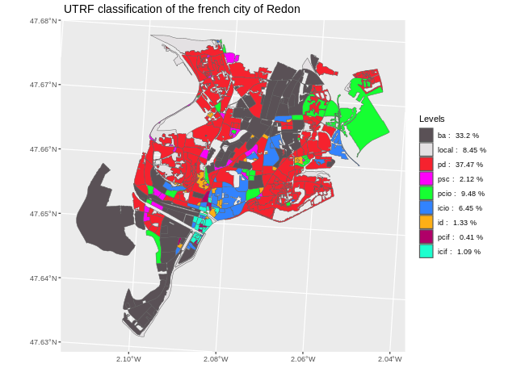
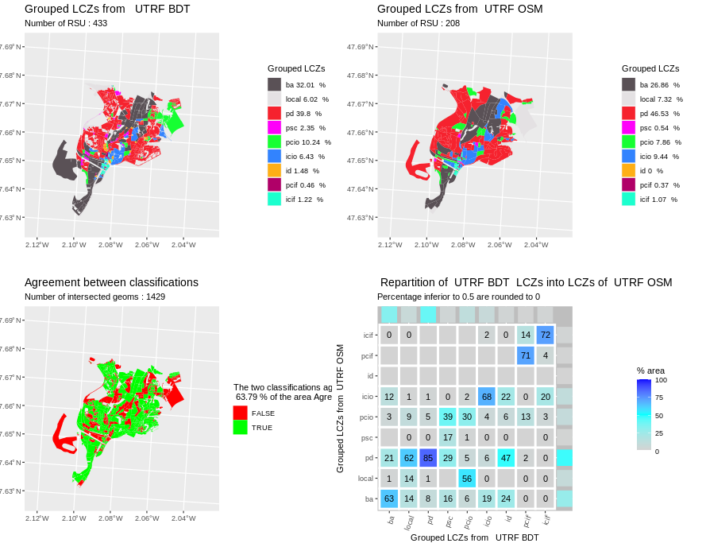

# Summary

Climate change is a growing concern for city planners as Urban Heat Islands have an impact on mortality [@clarke1972some], 
health in general [@lowe2016energy] and consumption of energy for building cooling [@malys2012microclimate] among other effects.
A first step towards large scale study of urban climate is to define classes based on logical division of the landscape, 
such as Local Climate Zones (LCZ) defined by [@stewart2012local].

The lczexplore package aims at comparing different LCZ classifications, 
but can be used to compare any pair of classifications on geographical units.

A spatial comparison is performed by producing agreement maps between classifications, agreement statistics and 
a confusion matrix to help qualify and quantify the misclassifications.

This software is available as a free and opensource R package.

# Statement of need

## Comparing maps
As stated in [@visser2006map] comparing map is an important issue in environmental research. 
The four main reasons to compare categorical variables on geographical units are:     
- to compare maps generated by models under different scenarios and assumptions,  
- to detect temporal changes,  
- to calibrate or validate models,   
- to perform uncertainty and sensitivity analysis.  


## Comparing specifically LCZ maps 

Climate change is a growing concern for city planners with a special focus on Urban Heat Island phenomenons.
The terms *rural* and *urban* lack of a clear definition and different classifications 
of urban and rural landscapes were proposed.
Stewart and Oke [@stewart2012local] defined an approach that complies with [@grigg1965logic] criteria of geographical classification.
Their Local Climate Zones (LCZ) are based on a logical segmentation of land-use and urban canopy parameters 
and define 10 urban types and 7 land cover types.

LCZ have gained popularity in the past decade as they sum up relevant information and can help, for instance, 
apprehend the intensity of the Urban Heat Island [@kotharkar2018evaluating].

Several methods aim to classify a territory into LCZ, but only few workflows allow an automatic classification for any given area.  
[@quan2021systematic] distinguishes two main streams of production of these LCZ:   

- the raster stream processes remotely sensed information, and applies machine learning 
algorithms trained using local experts' knowledge. For instance, the WUDAPT platform produced 
LCZ maps of Europe and North-America this way [@chingWUDAPTUrbanWeather2018a].   
- the vector stream uses Geographic Information System (GIS) layers that represent the main topographic features, 
defines spatial units, computes urban canopy parameters and uses them to classify spatial units into LCZ.
For instance, the GeoClimate geospatial toolbox produces LCZ classifications 
from OpenStreetMap or french BDTopo data [@bocher2021geoclimate].   

The existence of several methods to produce LCZ classifications, or the use of a method with different input data,
raises the need for a tool to quickly get :

1.  Statistics measuring the general agreement between two classifications
2.  A spatial representation to allow a fast visual assessment of the zones 
where the classifications agree or disagree.
3.  A confusion matrix, to explore how the levels of one classification break up 
in levels of the other classification, shown in a graphical way to help visualize the 
main differences between the classifications.

# State of the field and feature comparison

## State of the field on spatial classification comparison

The question of going beyond the simple visual observation of differences between maps is not a new one. 
A first approach would be, on raster maps, to simply compute the agreement between two maps as the proportion 
of pixels for which the two maps have the same value of the variable of interest. This approach is often enough 
to help specialists compare pairs of maps, but it presents two main drawbacks :  

 - two totally random maps won't have a value of agreement of zero as some pixel values may agree by chance,  
 - only raster maps where pixels match perfectly (same size, not translated) can be treated, or 
some pre-treatment are needed (like nearest neighbour interpolation for instance).  

To prevent the first drawback, [@monserudComparingGlobalVegetation1992] 
proposed the use of Cohen's kappa coefficient of agreement for nominal scales [@cohenCoefficientAgreementNominal1960].
Each pixel is seen as an individual to which each map assigns a value of a categorical variable 
(each map is seen as a "rater").  

The comprehensive Map Comparison kit which was released in 2001 by the 
Netherlands Environmental Assessment Agency [@visser2006map]. It is an example of tool  
that allows multiple methods to compare raster maps. It includes a fuzzy algorithm which allows to tackle small 
shifts of one map from another. It only works on raster maps, only on Windows OS and 
doesn't allow automation for several pairs of maps.  

To tackle the second drawback, one can rasterize vector files, for instance by applying a raster grid
to a vector layer and assign, for instance, the value whose area is the most present in the pixel.
This can produce severe effect of smoothing one may want to prevent. 

Other approaches also rely on comparing the distribution of some variables of interest. 
For instance [@hammerbergImplicationsEmployingDetailed2018], rather than comparing the maps, 
compares some model output variables using the data of the map.    

## State of the field on Local Climate Zone maps comparison. 

As Local Climate Zones emerged as a new standard for characterizing urban landscapes [@demuzereLCZGeneratorWeb2021], 
specific tools are needed to allow easy automation of LCZ maps. As a matter of fact, "ground truth" is hard to 
define in matters of LCZ, and one may want to compare LCZ produced by experts and by different algorithms. 

The very definition of LCZ by [@stewart2012local] relies on ranges of values for several indicators, and  sometimes
several LCZ types could be assigned to the corresponding geometries. Therefore, some algorithms associate a confidence 
value to the LCZ type and one may want to check if filtering pixels (for raster data) or geometries (for vector data) accordingly to a confidence threshold
has an impact on the way maps agree or disagree.   

A comparison of a raster stream result and a GIS vector stream approach was proposed by [@muhammad2022inference].
This comparison relies on rasterising vector data. It uses several tools: QGIS, python scripts and SAGA GIS. As far as we know, 
the scripts and the automation of the method are not publicly available.

The need for automation of vector comparison, and specific features (like standard colors or legends for standard LCZ) 
justified the development of `lczexplore`.

## Features

### General workflow and processing steps

The `lczexplore` package is a set of `R` functions  to load, show, group and compare LCZ classifications,
even when they don't use the same spatial units to classify the area. 
These LCZ classifications can come from vector layers or raster layers (the latter will be vectorized 
by the dedicated import function) 

{width="100%"}

Figure 1 describes the general workflow of the package.

Main functions are presented in plain lines, the dashed boxes and arrows represent optional steps. 
These functions are presented in next section.

1. First, the LCZ classifications (or any other qualitative variable) are imported, 
from a geojson or shapefile file format.
2. Each LCZ classification can then be visualized
3. Some LCZ levels may be grouped in broader categories
3.  The two LCZ classifications (or qualitative variable maps) are then compared :
    -  A map of agreement/disagreement is produced
    -  The general agreement and a pseudo-kappa indicator of agreement are computed. 
    -  The summed surface of each LCZ type is computed for each classification
    -  A confusion matrix shows how the levels of one LCZ classification break up into the levels of the other.
5.  Influence of the level of confidence on the agreement between classifications is performed 
(sensitivity analysis)   

All the steps of the analysis (except the production of the LCZ classification themselves) can be easily automated,
for instance on several cities at a time.

## Description of the main functions

The main functions are presented in this section. More details about their arguments and output can be found in the minimal example section.

### From import to comparison

The `importLCZvect` function allows to import a LCZ classification from a geojson or a shapefile.   
Geometries and LCZ types are needed, but one can also optionally load unique identifiers
and a confidence level for the LCZ type of each geometry.     
   
The `importLCZraster` function allows the import from a raster map, and the user has to feed it a geotiff 
and a bounding box of the area of interest.

The import functions output objects of class `simple feature`, as defined by the 
openGIS consortium and as handled by the `sf` package, an R reference library for 
Geographical Information System Vector Data [@RJ-2018-009].
   
The `compareLCZ` function creates intersected geometries on which classifications 
either totally agree or totally disagree, as seen in the figure 2, and this prevents artificial rounding effects 
that may arise with a rasterisation approach. 

{width="100%"}

Next, the function computes:

- the area of each LCZ type for each classification,  
- the percentage of area on which the two classifications agree, and a map of this agreement,  
- a pseudo kappa statistics which evaluates agreement beyond how two random maps may agree,  
- a confusion matrix of how the types of one LCZ classification break up in the types of the other,
and a graphic of this, with an indicator of the general area of the LCZ type (useful 
if the two classifications disagree on a type almost absent of the area).  

The output of these functions are shown in the minimal example section.

With the `standard` representation comparing LCZ is made easy by a default setting of legends and colors. 
The `alter` representation allows the user to deal with regrouped LCZ categories or any type of qualitative variable.  
Levels can either be specified by the user or deduced from the data, 
colors can either be defined by the user or chosen from a random palette. 

### Class levels grouping 

It is sometimes useful to group some LCZ types, for instance to create a broader category for
all the urban LCZ types and another for landcape LCZ types, 
or to group the levels with similar estimated impact on an urban heat island intensity.

The `groupLCZ` function allows the user to specify the LCZ types one wants to group together, 
the names of the new resulting categories and their corresponding colors.
One can then feed `compareLCZ` these new groups,  setting `repr="alter"`, and specify desired levels and colors. 


### Categorical variable (other than LCZ)

The workflow of comparison of LCZ maps can be used for any pair of maps of categorical variables, 
under certain limitations :   
- there must not be more than 36 levels for the categorical variable to explore   
- the geometries to which the variable levels are assigned must be (multi) polygons or easily converted to them
 (typically, the package would not be suitable to compare road characterization),    
- the geometries must be topographically valid (this is also true for LCZ).     

The `importQualVar` function allows the import of such variables on (multi-) polygons maps.
It outputs an sf object that can be fed to the other main functions 
of the package (`showLCZ`, `compareLCZ`, `groupLCZ`, `confidSensib`...).

### Sensitivity analysis

The Geoclimate algorithm adds a uniqueness value to the LCZ type it assigns to a spatial unit. 
It measures if another LCZ levels could have been assigned to this unit. Thus, it can be seen 
as a confidence value of the LCZ type.  
The `lczexplore `package allows a sensitivity analysis according to this level of confidence, 
in order to answer the question : 
**does keeping only geometries with a higher confidence value 
make the degree of agreement between two classifications higher?** 

This sensitivity analysis is performed considering all LCZ types and within each individual LCZ type.


The agreement between classifications for the geometries with a confidence level higher than the threshold, 
and their numbers, are plotted in blue.
The agreement and the numbers of geometries under the threshold are plotted in magenta. On this example, 
one can see that ditching geometries that have a confidence level lower than 0.5 leads to an increase of the agreement
up to more than 90%. The curve then tends to flatten, and the number of kept geometries  a lot (from 602 to 122).
One also needs to notice that on this example, most geometries didn't have a confidence value 
(7476 with a general agreement of 59.21%)

# Coding implementation

`lczexplore` is an R package, all its specific functions are coded in R language.
It relies on state-of-the art packages :   
- geographical computation requires the `sf` package for vector data and the `terra` package for raster data,   
- data management mainly requires the following packages : `dplyr, tidyr, forcats, rlang` and `methods` packages,   
- graphical production uses `ggplot2, grDevices, cowplot` and `RColorBrewer`,   
- tests need the `tinytest` package.   

Every step corresponds to an R function (see the workflow on figure 1 for the name of the main functions).
Every function has an associated file for unitary testing.

# A minimal example

## Install and load

The lczrexplore package can be downloaded from `https://github.com/orbisgis/lczexplore`

You can install it in R with the command `install_github`:

``` r
library(devtools)
devtools::install_github("orbisgis/lczexplore",build_vignettes = TRUE)
library(lczexplore)
```

In order to discover the package vignettes can be browsed via `browseVignettes("lczexplore")` or by calling them directly :

```r
vignette("lczexplore_en")
vignette("lczexplore_raster_vector")
vignette("lczexplore_alter")
```


## Import the data

In this example we will use two LCZ classifications of Redon city, 
produced using a single LCZ classification method (the GeoClimate workflow), 
but taking two different input data: OpenStreetMap (OSM) and the 2.2 version of the
French BDTopo.

```r

# Set the path to the example data folder created once you install the package

dirPath<-paste0(system.file("extdata",package="lczexplore"),"/")
dirPathOSM<-paste0(dirPath,"osm/2022/Redon")
dirPathBDT<-paste0(dirPath,"bdtopo_2_2/Redon")

# Import into an sf object the data produced with GeoClimate and
# the OpenStreetMap data (city of Redon)
redonOSM<-importLCZvect(dirPath=dirPathOSM, 
                        file="rsu_lcz.geojson", column = "LCZ_PRIMARY")

# Import into an sf object the data produced with GeoClimate and 
# the french BD TOPO data (city of Redon) 
redonBDT<-importLCZvect(dirPath=dirPathBDT, 
                        file="rsu_lcz.geojson", column = "LCZ_PRIMARY")
```

## Visualize the data

To visualize a LCZ classification, use the `showLCZ` function. Setting `repr` to `"standard"` directly 
deals with standard values of LCZ levels and colors.

``` r
# Plot the LCZ levels on the Redon Area using the default color set
# from the sf object produced by importLCZvect function

showLCZ(sf=redonOSM, wf="OSM", column="LCZ_PRIMARY", repr="standard")
```


The result is a map of the Local Climate Zones on the area :

{width="100%"}

## Compare the two LCZ classifications

To compare the two loaded LCZ classifications, use the `compareLCZ` function. 

- The `sf1` and `column1` arguments allow to specify the sf dataset of the first map, and the column in which 
the LCZ levels are stored (same for `sf2` and `column2`), 
- the `wf1` and `wf2` arguments take strings to specify the workflows used to produce the input data. The `location`
argument allows to name the area of interest covered by input datasets. These arguments will be parsed in 
the legends of the graphics and the name of potential csv output files,  
- when `exWrite=TRUE`, the data computed to create the confusion matrix will be written 
in a csv file in the working directory,  
- if `saveG=TRUE`, the four plots created by the function will be written in a png file in the working directory.

```r
# Compare how the BDTopo and the OpenStreetMap Data produce different classifications. 
# The outputs are stored in a list.

comparison<-compareLCZ(sf1=redonBDT,column1="LCZ_PRIMARY", wf1="BDTopo v2.2", 
           sf2=redonOSM, column2="LCZ_PRIMARY", wf2="OpenStreetMap", ref=1,
           repr="standard", exwrite=F, location="Redon")
```

All graphics are concatenated for a quick glance:

{width="100%"}

The first and second maps show the spatial repartition of the first and second LCZ types, respectively.  
The third map shows where the two classifications agree or disagree.  
The last graphic is a confusion matrix: how do the LCZ types of the first classification break-up in those 
of the second, in percentage of the surface.  

`CompareLCZ ` outputs a list called `matConfOut` which contains :

- `$data` the intersected geometries, their identifiers (if `geomID` was not empty), their LCZ type and their area,  
- `$areas` the summed area for each LCZ for both classifications,  
- `$matConfLarge` the confusion matrix,  
- `$percAgg` the general agreement of the two classification on the whole area
(as a percentage of the global surface of the area),  
- `$pseudoK` the value of a heuristic pseudo Cohen's Kappa coefficient of agreement.  

The value `pseudoK` corresponds to a coefficient of agreement, 
where the cells of the cross tabulation would be 
weighted by the percentage of the concerned surface.   

On can see in a quick glance, that the BDTopo workflow leads to more and smaller Spatial Reference Units (1553 RSU) 
than the OpenStreetMap workflow (521 RSU). The third map shows that wide both classification tend to 
agree on wide vegetation areas. The last graphics helps to refine this analysis : One can notice that 
both workflows quite agree for "compact mid" and "low plants" LCZ (89 and 88 % of the concerned areas). 
On the contrary, only 48% of the areas set to "dense trees" by BDTopo workflow are also set to 
"dense trees" by OpenStreetMap workflow, while 37% of these areas are set as "low plants."

In the same way, 73% of the areas set to "compact low" by 
BDTopo workflow are set to "compact mid" by OpenStreetMap workflow. This is coherent with the fact that building heights
are often missing on OpenStreetMap and that the algorithm that GeoClimate uses to predict them is less precise than
the available information of BDTopo. One may read more in [@bernardGenericAlgorithmAutomatically2023] 
(preprint at the date of submission of the present article?) about differences between these workflows. 


## Study the impact of confidence on agreement

The following code produces an example of confidence sensitivity analysis of the agreement
according to the threshold of confidence above which one keeps the geometries of the maps. 

```r

 # Set the path to the folder where compareLCZ stored output data file
 mainPath<-system.file("extdata", package = "lczexplore")
 # Read the csv file where compareLCZ stored the output data. 
 
 testSourceFact<-read.csv(paste0(mainPath,"/bdtopo_2_2_osm.csv"),
 sep=";",header=TRUE,stringsAsFactors = TRUE)

 
 # (One could use data from the $data slot of R object too).
 # testSourceFact<-comparison$data
 
# Perform the sensitivityanalysis on this file
# One can also directly read the sfFile without importing it. 
# To do so leave inputDf argument empty but set the filePath argument.   

 sensitAnalysis<-confidSensib(inputDf=testSourceFact, filePath="",
 nPoints=5, wf1="bdtopo_2_2", wf2="osm",
 geomID1="ID_RSU", column1="LCZ_PRIMARY", confid1="LCZ_UNIQUENESS_VALUE",
 geomID2="ID_RSU.1",column2="LCZ_PRIMARY.1", confid2="LCZ_UNIQUENESS_VALUE.1",
 sep=";", repr="standard", plot=TRUE, saveG=mainPath)

```

It results in the following graphic, for the agreement per LCZ type (types not present in the dataset are excluded).

 

For each LCZ type, the x-axis shows the minimum confidence threshold.  Note that in this particular example, 
the confidence information is given based on an evaluation of the method confidence, not the input data confidence.
The y-axis shows the agreement levels.  
Each cyan point shows the average agreement between classifications for spatial units where 
the minimum confidence value is greater than the x-axis value.    

As one wants to be sure the dropped units 
didn't have a greater agreement, they are showed as magenta triangles.
For this particular example, it seems that for the "Open Low" LCZ type, 
the greater the confidence, the lesser the agreement!

This paradoxical result is explained by the fact that in this specific case, the method is characterized 
by the confidence value, not the data. And in this comparison, in the OSM dataset which is compared, 
the building height are mostly estimated using a statistical method [@bernardEstimationMissingBuilding2022]. 
Thus, in this case, the confidence interval is not necessarily relevant.

## Group some levels and perform the same analysis

Use the `groupLCZ` function to regroup some levels into a category.
Pass the name of a category and the vector of the levels it shall group, as seen in the following code. 

```r 
redonOSMgrouped<-groupLCZ(redonOSM,column="LCZ_PRIMARY", 
                           urban=c("1","2","3","4","5","6","7","8","9"),
                           industry="10", 
                           vegetation=c("101","102","103","104"),
                           impervious="105",
                           pervious="106", 
                           water="107",
                           colors=c("red","black","green","grey","burlywood","blue"))
                           
redonBDTgrouped<-groupLCZ(redonBDT,column="LCZ_PRIMARY", 
                           urban=c("1","2","3","4","5","6","7","8","9"),
                           industry="10", 
                           vegetation=c("101","102","103","104"),
                           impervious="105",
                           pervious="106", 
                           water="107",
                           colors=c("red","black","green","grey","burlywood","blue"))   

```

By default, the column of the new regrouped categories is named "grouped", 
but you can set it with the argument `outCol`.

You can then perform the same analysis, as showed in the following example :
```r
showLCZ(redonOSMgrouped, column="grouped",repr="alter",
        title="Regrouped Categories for the city of Redon",
        LCZlevels = c("urban","industry","vegetation","impervious","pervious","water"),  
        colors=c("red","black","green","grey","burlywood","blue"))
compareLCZ(sf1=redonOSMgrouped, column1="grouped", wf1="OpenStreetMap data",
            sf2=redonBDTgrouped, column2="grouped", wf2="BDTopo data",ref=1,
           repr="alter",exwrite=F,location="Redon",saveG="",
           LCZlevels = c("urban","industry","vegetation","impervious","pervious","water"),
           colors=c("red","black","green","grey","burlywood","blue"))
```


You can also map any qualitative variable using this grouped representation, as long as you specify the expected levels the same way.

## An example of qualitative variables

The function `importQualVar` allows you to import maps of qualitative variables on (multi)polygons. 
For instance, we will import a classification of urban tissue called Urban Typolgy by Random Forest [@bocherGeoprocessingFrameworkCompute2018].
After the import, the usual functions can be used, as shown in the following code :

```r
utrfRedonBDT<-importQualVar(dirPath=paste0(
  system.file("extdata", package = "lczexplore"), "/bdtopo_2_2/Redon"),
  file="rsu_utrf_area.geojson", column="TYPO_MAJ")
  
showLCZ(sf=utrfRedonBDT, column="TYPO_MAJ",repr="alter", 
        title = " UTRF classification of the french city of Redon")
```


```r
utrfRedonOSM<-importQualVar(dirPath=paste0(
  system.file("extdata", package = "lczexplore"),"/osm/2022/Redon"),
  file="rsu_utrf_area.geojson", column="TYPO_MAJ",geomID="ID_RSU",confid="UNIQUENESS_VALUE")
  
  utrfComparison<-
    compareLCZ(sf1=utrfRedonBDT, column1="TYPO_MAJ",wf1=" UTRF BDTopo",
               sf2=utrfRedonOSM, column2="TYPO_MAJ", wf2 = " UTRF OpenStreetMap",
  location = " Redon",exwrite=FALSE,repr="alter")
  # Plot the confusion matrix of thes two classifications  
```


# Research projects involving lczexplore

The lczexplore package was developed thanks to the project PAENDORA2 (Pour la gestion du confort estival : Données, Outils et Recherche-Action) (2022 -2025), funded by ADEME.

# References
