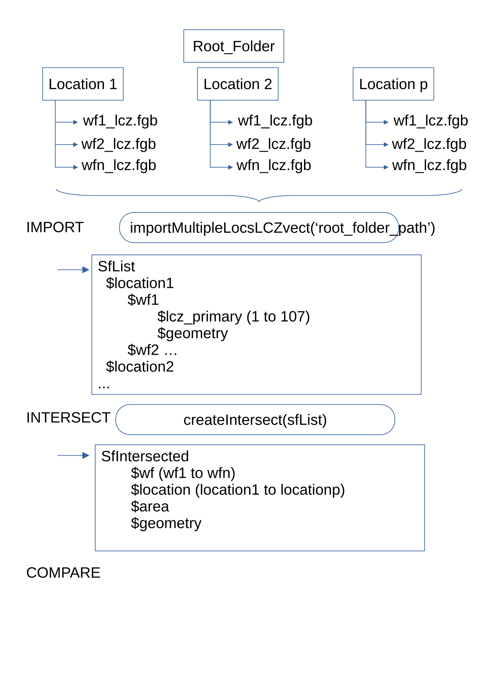

```{r, settings, include = FALSE}
knitr::opts_chunk$set(
  collapse = TRUE,
  comment = "#>",
  out.width="100%"
)
if (!require("png")) {
  install.packages("png",repos = "http://cran.us.r-project.org")
  library("png")
}
```

This vignette focuses on loading, intersecting and comparing multiple (3 to 5) LCZ maps on the same area
or set of areas.
The first part of the vignette describes the recommended pipeline, which should cover most of the cases.

Some specific functions are described later on for more specific cases.

Note : Only vector workflows (as opposed to raster) can be processed when comparing more than 2 workflows.  `lczexplore::importLCZraster` function allows to import raster images with an LCZ band and `sf::write_sf` re-exports
them, for instance to FlatGeobuf (.fgb)

# Context and vocabulary
## Local Climate Zones
Climate change is a growing concern for city planners.
Stewardt and Oke have proposed a classification into Local Climate Zones (LCZ)
that describes rural and urban areas, with 10 built types and 7 land cover types.
Several workflows allow to produce LCZ maps, and none can be considered as
an absolute reference.
Therefore, there is a need for comparison of maps produced by different workflows on the same area.

This vignette shows how to compare 3 workflows (i.e. their resulting maps) at a time. The process can be extended
to more maps, but graphical outputs may become hard to read for more than 4 or 5 workflows.

This package does not produce LCZ maps, but imports, shows and compare maps from standard GIS format, with a prefered input format in flatGeoBuffer (.fgb).

## Spatial Units
Each LCZ map partitions the territory into spatial units, for instance regular grid when based on raster image,
or topographic spatial units.
Each spatial unit is assigned a LCZ type. When comparing different maps,
one needs to intersect all spatial units to obtain units common to all maps.
On each intersected unit, it is then possible to look if two workflows agree or disagree.

# Data preparation for multiple workflows and multiple study areas
The most generic case study is when several maps are available for several locations.
A simple folder tree allows an easy analysis.

## Input data structure
When several LCZ maps are available for several places and stored
into local files, the following data structure allows an easier analysis.

--main_data_directory

|

|--location1

    |--wf1_lcz.fgb

    |--wf2_lcz.fgb

    |--wfp_lcz.fgb

|--location2

    |--wf1_lcz.fgb

    |--wf2_lcz.fgb

    |--wfp_lcz.fgb


The main data directory must contain only the data subdirectories,
as the loading functions will span the subdirectories searching for data.

In each subdirectory, the data are stored in files named `wfNamei_lcz.fgb`
where <wfNamei> are the names of the workflows. In the tree above, the workflows are called wf1 and wf2.

Other spatial extensions may work, but `.fgb` files are recommended and were the most tested.

## General steps to compare several LCZ maps

*Import.* First, all the data is loaded in a list.

This list contains a sublist for each location, and each location sublist contains one sf object for each LCZ map.

*Intersection.*
Second, the spatial units of all maps (i.e. the geometries bearing the LCZ type) are intersected.
On any resulting geometry, a pair of workflow either totally agree or totally disagree. Intersection is done within lists,
which allows to try to intersect only geometries of the same location. The result is concatenated in a single sf objects
which contains a column for each lcz map, named after the workflow it comes from,
a column with the location name, a column with the area and a column with the
geometry for each intersected spatial unit.

*Visualisation*

Simple descriptive barplots give a general idea of the behavior of the different workflows.

Pairwise comparison allow a visual correspondence between 2 workflows.

Circular Chord Diagram allow a simultaneous visualization of correspondences between all workflows.

*Numerical Comparison*

Pairwise agreement between workflow and consensus value for each LCZ type quantify this comparison.




## Importing maps from several locations and several workflows

In case of several workflows and several locations, the function `loadMultipleLocsSfs` allow to load all the
data in a list.

In the data structure from above section, the function would be applied
to the `main_directory` folder.

The small data files for this vignette are in the `inst/extdata/multipleWfs` folder, which contains the locations
Arville and Redon, for which three LCZ maps are available, produced by the following workflows :
- GeoClimate based on OpenStreetMap input data
- GeoClimate based on french Geographical Information Institute database called BDTOPO
- WUDAPT, based on satellite images and machine learning.


```{r,loadAllLocsAllWfs}
require(lczexplore)
twoLocsDir<-paste0(
  system.file("extdata", package = "lczexplore"),"/multipleWfs")
twoLocsSfList<-loadMultipleLocsSfs(dirPath = twoLocsDir, workflowNames = c("osm","bdt","wudapt"),
                                   location = c("Arville", "Redon"))
```

The function `loadMultipleLocsSfs` loads all the input .fgb files in a list.

When comparing maps for only one location use the similar function `loadMultipleSfs`.

## Intersecting geometries from the different workflows
The spatial units

In the case of only two workflows, the function `compareLCZ` loads the two `sf` objects, intersects their geometries,
produce the array of correspondance between the LCZ types of the two workflows.

With more than two workflows, one needs more control over the intersection steps.
First, in case of multiple locations, the intersection of the several workflows must occur within each location.
Second, intersecting the spatial units of multiple workflows can lead to artificially small geometries.

The `createIntersect` function allows to specify a minimal area threshold. Resulting geometries whose area are lesser than this threshold will be discarded.

```{r, Intersect}
twoLocsSfIntersected <- createIntersect(sfList = twoLocsSfList, columns = rep("lcz_primary", 4),
                                        refCrs=NULL, workflowNames=c("osm", "bdt", "wudapt"), minZeroArea=0.000)
```

Note : the function `createIntersect` is able to see if the list fed to the sfList argument has one or two levels,
i.e. if there are one or multiple locations.

# Visualizing the data

## Reminder: visualize a single map
The `twoLocsSfList` list contains one sf object per workflow per location.
This sf object can be fed to the function `showLCZ()` for a map and a summary of the area classified in each LCZ type.

```{r, showLCZ, fig.width=8, fig.height=5}
showLCZ(sf = twoLocsSfList$Redon$osm, column = "lcz_primary", repr = "standard")
```

## Reminder: comparing two simple maps
One can also compare two maps from the same location using the function `compareLCZ()`

Note : for only 2 maps, the user feeds compareLCZ the sf files, the function does the intersection.

```{r, compareLCZ, fig.width=16, fig.height=10}
redonOSM <- twoLocsSfList$Redon$osm
redonBDT <- twoLocsSfList$Redon$bdt
compareLCZ(sf1 = redonOSM, sf2 = redonBDT, column1 = "lcz_primary", column2 = "lcz_primary", wf1 = "osm", wf2 = "bdt_V_2")
```

## Area per LCZ type and workflow for more than 2 workflows

The function `barplotLCZfromIntersected` allows the visualisation of what area is classified into each LCZ type
of each workflow.
```{r, barplotLCZfromIntersected, fig.width=8, fig.height=5}
areaPerLCZtype<-barplotLCZfromIntersect(sfIn = twoLocsSfIntersected, workflowNames = c("osm", "bdt", "wudapt"))
```

# Compare multiple workflows
The function `compareMultipleLCZ` outputs a list containing two objects.
The first one is an sf object, named sfInt. It contains the LCZ type for each workflow,
the pairwise agreements, and the number of workflows who agree for each geometry (ie, intersected spatial units).

```{r, multiple-comparison}
twoLocsCompared <- compareMultipleLCZ(
  sfInt = twoLocsSfIntersected,
  columns = c("osm","bdt","wudapt"),
  trimPerc = 0)
```
## Pairwise agreements
From this sfInt object, the function `workflowAgreeAreas` compute pairwise agreement between workflows,
defined as the sum (or percentage) of the area on which two workflows agree.

```{r, multiple-pairwise-agreement}
workflowAgreement<-workflowAgreeAreas(twoLocsCompared$sfIntLong)
```

## Repartition from one workflow to another and data visualisations

To explore this agreement further, we compute all the repartition from an LCZ type from a workflow to the LCZ types of another workflow, using the function `createWeightedFlux`

```{r, multiple-confusion-matrix}
twoLocsFlow<-createWeightedFlux(twoLocsSfIntersected, wfNamesIn = c("osm","bdt","wudapt"))
```

To avoid exploring all the pairwise possible matrices, we can explore these correspondences through
a circular chord diagram, using the function `drawChordDiagram`.

```{r, chord-diagram, fig.width=8, fig.height=5}
drawChordDiagram(weightedFluxIn = twoLocsFlow)
```


### General repartitions of types from one workflow to another


### An advanced fonction
When, for a location, some workflows have missing geometries, i.e. don't map some area and leave them as holes,
one can put a zone.fgb file in the directory, and the function `loadConcatAllLocsAllWfs` will allow to use it
and create the missing geometries and assign them a given type.
Feed the name of the workflow whose geometries are missing to the `missingGeomWf` argument, and
the function will intersect it with the `zone.fgb` geometries.
Sometimes, the missing geometries can be of one type, as a decision from the designers of the LCZ workflow.
In this case, one can choose another workflow as a reference (through `refWf`) and the corresponding LCZ typ (through `refLCZ`). The remaining geometries which wouldn't intersect with the Chosen LCZ type of the chosen reference workflow will receive the value fed to `residualLCZvalue`.

```{r, load-concat-complete}
twoLocsDir<-paste0(
  system.file("extdata", package = "lczexplore"),"/multipleWfs")

# allWfsAllLocs<-loadConcatAllLocsAllWfs(twoLocsDir, locations = NA, workflowNames = c("osm", "bdt", "wudapt"),
#                                        missingGeomsWf= "osm", refWf = NULL, refLCZ = NA,
#                                        residualLCZvalue = NA, column = "lcz_primary")
```
